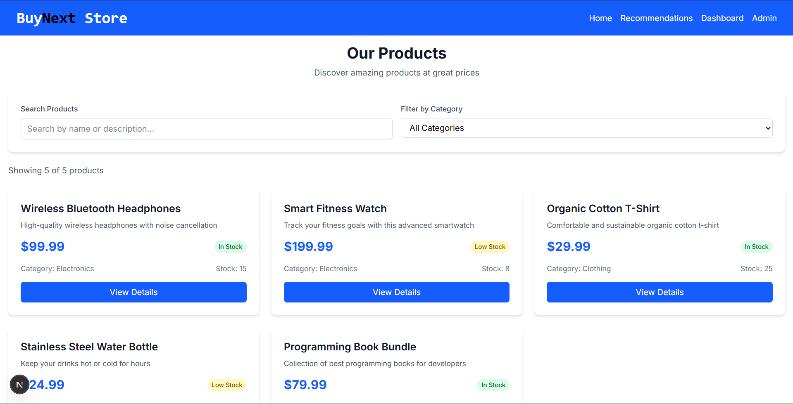
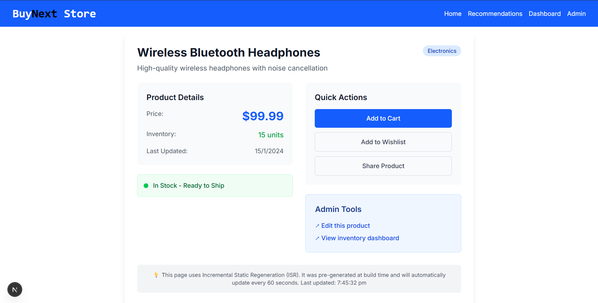
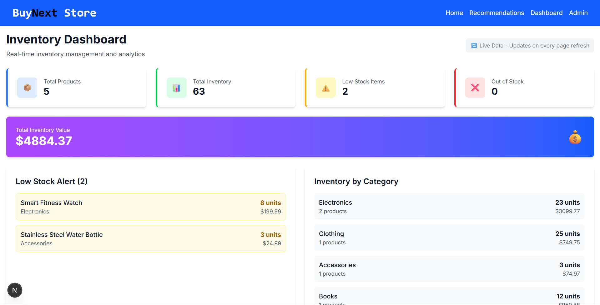
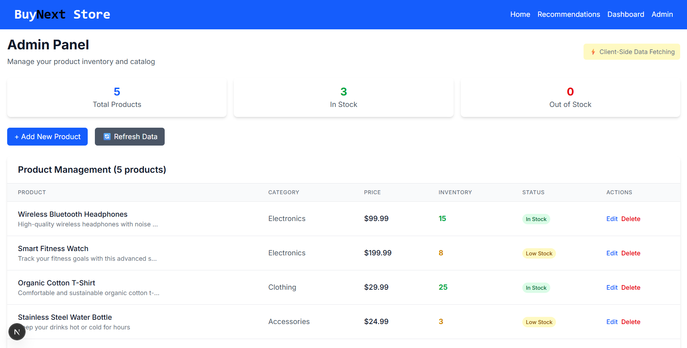
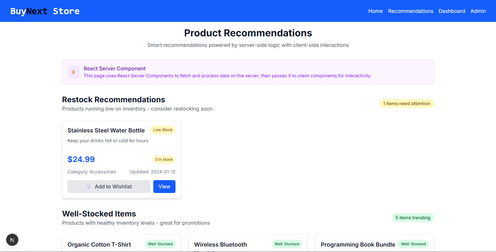

 # BuyNext Store - e-commerce-style web application
 ## A modern e-commerce product catalog built with Next.js 16.0.1, TypeScript, and Tailwind CSS. This application demonstrates multiple rendering strategies available in Next.js across different pages.

 ##  Project Structure


ecommerce-app/<br>
├── app/                    # Next.js App Router<br>
│   ├── api/               # API routes<br>
│   │   └── products/      # Product API endpoints<br>
│   ├── products/         
│   │   └── [slug]/        # Product detail pages<br>
│   ├── components/        # React components<br>
│   ├── dashboard/         # Inventory dashboard<br>
│   ├── admin/             # Admin panel<br>
│   ├── recommendations/   # Recommendations page<br>
│   └── layout.tsx         # Root layout<br>
├── data/                  # Mock data<br>
│   └── products.json<br>
├── lib/                   # Utility functions<br>
│   └── data.ts<br>
├── types/                 # TypeScript definitions<br>
│   └── product.ts<br>
└── public/                # Static assets<br>

## 🚀 Quick Start

### Prerequisites
Node.js 18.17 or later

npm or yarn

### Installation & Running
Clone the repository

```bash
git clone <your-repository-url>
cd ecommerce-app
```
### Install dependencies

```bash
npm install
```
### Run the development server

```bash
npm run dev
```
### Open your browser
Navigate to http://localhost:3000

## 📸 Screenshots
### Home Page (SSG)

### Product Detail Page (ISR)



### Inventory Dashboard (SSR)



### Admin Panel (CSR)



### Recommendations (RSC)


## 📊 Rendering Strategies
### 1. Home Page (/) - Static Site Generation (SSG)
Rendering Strategy: Static Generation with Client-Side Interactivity

Why SSG?

The home page displays product listings that don't change frequently

Excellent performance and SEO benefits

Can be cached at the CDN level

Client-side search/filtering provides interactivity without server requests

Implementation:

Data fetched at build time using getProducts()

Client-side components handle search and filtering

Zero loading time for returning visitors

### 2. Product Detail Page (/products/[slug]) - Incremental Static Regeneration (ISR)
Rendering Strategy: ISR with 60-second revalidation

Why ISR?

Product pages need to be fast but may have changing data (prices, inventory)

Balances performance with data freshness

Automatically updates stale content without rebuilding entire site

Perfect for e-commerce where prices/inventory change periodically

Implementation:

Pages pre-generated at build time using generateStaticParams()

Revalidates every 60 seconds when pages are visited

revalidate = 60 ensures data stays fresh

### 3. Inventory Dashboard (/dashboard) - Server-Side Rendering (SSR)
Rendering Strategy: Server-Side Rendering

Why SSR?

Dashboard shows real-time inventory data

Requires fresh data on every page load for accurate business decisions

Protected content that may require authentication

Always displays the most current inventory status

Implementation:

export const dynamic = 'force-dynamic' ensures no caching

Data fetched on every request

Fresh statistics and alerts for inventory management

### 4. Admin Panel (/admin) - Client-Side Rendering (CSR)
Rendering Strategy: Client-Side Rendering with Client-Side Data Fetching

Why CSR?

Highly interactive interface with forms and real-time updates

Rich user interactions without page reloads

Better user experience for administrative tasks

Can implement complex client-side validation

Implementation:

Uses useEffect and fetch for data loading

Client-side state management for forms

Real-time UI updates after mutations

### 5. Recommendations Page (/recommendations) - React Server Components (RSC)
Rendering Strategy: Hybrid Server + Client Components

Why RSC?

Demonstrates modern Next.js App Router architecture

Server components handle data processing and recommendations

Client components manage interactive elements (wishlist buttons)

Optimal performance with clear separation of concerns

Implementation:

Server component fetches and processes recommendation data

Client component handles wishlist interactions

Zero JavaScript bundle for server-rendered parts

## 🛠️ API Routes
### Product Endpoints<br>
GET /api/products - Fetch all products

GET /api/products/[slug] - Fetch single product by slug

POST /api/products - Create new product (protected)

PUT /api/products/[slug] - Update product (protected)

### Authentication <br>
Admin routes are protected with simple bearer token authentication:
``` bash 
Authorization: Bearer admin-key-123
```
## Data Storage
#### Currently using a JSON file (data/products.json) for simplicity. Can be easily replaced with:

MongoDB

PostgreSQL

Any other database
## 🎯 Key Features
✅ Multiple rendering strategies demonstration

✅ TypeScript for type safety

✅ Responsive design with Tailwind CSS

✅ Client-side search and filtering

✅ Real-time inventory management

✅ Product CRUD operations

✅ Hybrid server/client components

✅ API routes with mock authentication

## 👨‍💻 Developer

## Sahil Salap
#### Date: 29 Oct 2025
## sahilsalap75@gmail.com


